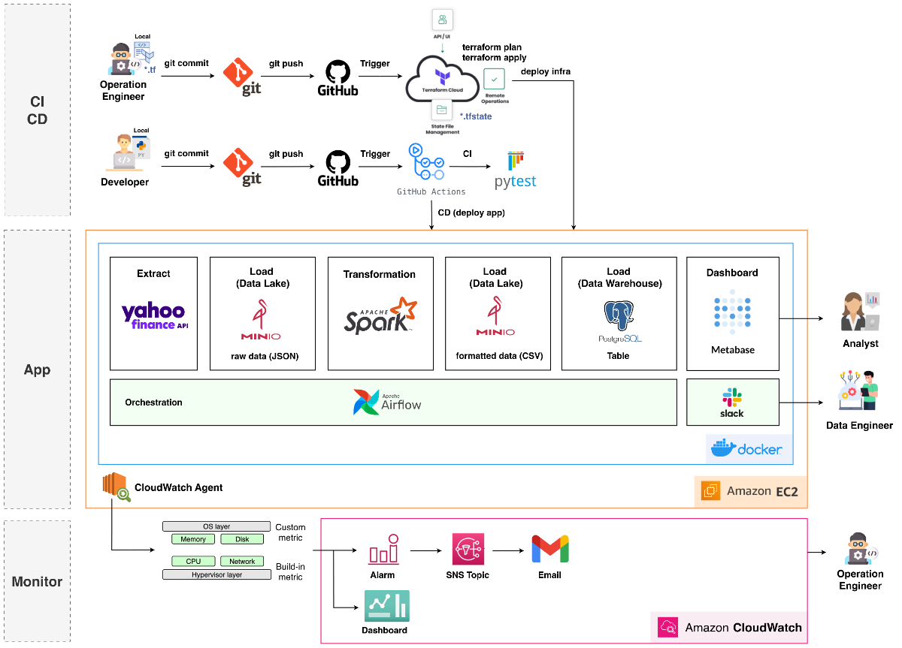

# **Docker based setup of Spark and Airflow**
This repository provides a containerized environment for Apache Spark and Apache Airflow using Docker, allowing you to quickly set up a development environment for data engineering tasks.

## Architecture


## Overview
This setup enables you to:
- Run Apache Airflow for workflow orchestration
- Execute Apache Spark jobs from Airflow
- Process data using Spark within Docker containers
- Test and develop DAGs in an isolated environment

## Reference
Original repository: https://github.com/ankit-rawani/spark-airflow-docker/tree/main

## Prerequisites
- Docker installed on your system
- Git for cloning the repository
- Basic understanding of Airflow and Spark concepts

## Project Structure
- `dags/`: Contains Airflow DAG definitions
- `logs/`: Airflow logs directory
- `plugins/`: Airflow plugins
- `config/`: Configuration files
- `spark/app/`: Spark applications code

## Dockerfile

The project uses two main Dockerfiles:

### Airflow Dockerfile

The `Dockerfile` in the root directory creates a customized Airflow image with all necessary dependencies:

- **Base Image**: Uses `apache/airflow:2.10.5-python3.12` as the foundation
- **Java Installation**: Installs OpenJDK 17 for Spark integration
- **Custom Dependencies**: 
  - Installs packages from `requirements.txt`
  - Adds specific Airflow provider packages for Spark and PostgreSQL
  - Includes PySpark for Spark job development

This image is used for all Airflow services (webserver, scheduler, init) and provides a consistent environment with all the tools needed for data workflow orchestration.

### Spark Application Dockerfile

The `spark/app/stock_transform/Dockerfile` builds a specialized Spark application image:

- **Base Image**: Uses `bitnami/spark:3.5.0` for Spark functionality
- **Python Setup**: Installs Python packages needed for data processing
- **Application Code**: Copies the stock transformation code to the container
- **Environment Configuration**: Sets up connection parameters for MinIO
- **Entry Point**: Configured to run the Spark job via `spark-submit`

This image is used when executing Spark jobs from Airflow DockerOperator, providing a dedicated environment for data processing tasks.

## Docker Compose 
This project uses Docker Compose to orchestrate multiple containers that work together to provide a complete data engineering environment. 
Below is an explanation of the key components in our `docker-compose.yaml` file.

### Key Services
The Docker Compose configuration includes the following services:

#### Airflow Components
- **airflow-webserver**: The Airflow UI, accessible at http://localhost:8080
- **airflow-scheduler**: Schedules and triggers workflow execution
- **airflow-init**: One-time initialization service (runs once to prepare the environment)
- **postgres**: Database for Airflow metadata

#### Data Processing Components
- **spark-master**: Spark master node, with UI at http://localhost:8082, job submission port at spark://spark-master:7077
- **spark-worker**: Spark worker node(s) that execute tasks, with UI at http://localhost:8081
- **minio**: S3-compatible object storage, with UI at http://localhost:9001, API at http://localhost:9000 
- **metabase**: Data visualization tool, accessible at http://localhost:3000
- **docker-proxy**: Allows Airflow to communicate with the Docker daemon

### One-Time Initialization Service

The `airflow-init` service is a special one-time service that:
- Initializes the Airflow database
- Creates the default admin user
- Sets up directory permissions
- Performs environment checks (memory, CPU, disk space)

This service is designed to run once and exit successfully. Other services depend on its successful completion before starting, indicated by the `condition: service_completed_successfully` parameter.

### Networks and Communication

All services are connected through the `default_net` bridge network, allowing them to communicate with each other using their service names as hostnames. 
For example, Spark services can be accessed at `spark-master:7077`.

### Volume Mappings

Key volume mappings include:
- `./dags:/opt/airflow/dags`: DAG definitions
- `./logs:/opt/airflow/logs`: Airflow logs
- `./plugins:/opt/airflow/plugins`: Airflow plugins
- `./spark/app:/usr/local/spark/app`: Spark applications
- `./spark/resources:/usr/local/spark/resources`: Spark resources
- `./plugins/data/minio:/data`: MinIO persistent storage
- `./test:/opt/airflow/test`: Unit Test

## STEP1. Set Up Instructions
To setup the project, follow these steps:

1. Clone this repository to your local machine
2. Run the following commands to initialize the environment:
```bash
# Create required directories and set permissions
mkdir -p ./dags ./logs ./plugins ./config
echo -e "AIRFLOW_UID=$(id -u)" > .env

# Pull Docker images from DockerHub
docker compose pull
# Build the new images from Dockerfile
docker compose build --no-cache

# Initialize Airflow database and users (airflow-init container run once and stopped after command completes)
docker compose up airflow-init
# Start all services (Run containers from images), because other services depend on airflow-init successful completion before starting 
docker compose up -d

# Build the stock-app image for Spark processing
docker build -t airflow/stock-app ./spark/app/stock_transform
```

After running these commands, you can access:
- Airflow webserver at http://localhost:8080 (default credentials: airflow/airflow)
- Spark master UI at http://localhost:8181

## STEP2. Connection Setup on Airflow Web UI
After starting the Airflow web server, set up the connection by navigating to Admin > Connections and creating a new connection with the following parameters:

### API
```bash
Connection Id: stock_api
Connection Type: HTTP
Host: https://query1.finance.yahoo.com/
Extra:
{
	"endpoint":"/v8/finance/chart/",
	"headers": {
		"Content-Type": "application/json",
		"User-Agent": "Mozilla/5.0",
		"Accept": "application/json"
	}
}
```
### MinIO
```bash
Connection Id: minio
Connection: Amazon Web Services
Access Key ID : minio
Secret Access Key: minio123
Extra:
{
  "endpoint_url": "http://minio:9000"
}
```
### Postgres
```bash
Connection Id: postgres
Connection: Postgres
Host: postgres
Login: airflow
Password: airflow
Port: 5432
```

## STEP3. Rebuilding Environment
If you need to completely rebuild your environment:

```bash
# Stop containers and remove volumes
docker-compose down --volumes --remove-orphans
# Remove unused volumes
docker volume prune -f
# Clean up unused Docker resources
docker system prune -f
```
```bash
# Pull Docker images from DockerHub
docker compose pull
# Build the new images from Dockerfile
docker compose build --no-cache

# Initialize Airflow database and users
docker compose up airflow-init
# Start all services (Run containers from images)
docker compose up

# Build the stock-app image for Spark processing
docker build -t airflow/stock-app ./spark/app/stock_transform
```

## STEP4. Testing DAGs and Tasks
To test your Airflow DAGs and individual tasks:

### DAG: stock_market
```bash
# Access the Airflow webserver container
docker exec -it stock-with-cicd-airflow-webserver-1 /bin/sh

# Test entire DAG
airflow dags test stock_market 2025-04-28

# Test individual tasks
airflow tasks test stock_market is_api_available 2025-04-28
airflow tasks test stock_market get_stock_prices 2025-04-28
airflow tasks test stock_market store_prices 2025-04-28
airflow tasks test stock_market format_prices 2025-04-28
airflow tasks test stock_market load_to_dw 2025-04-28
```

## Updating Code
When you make changes to your code (not related to Docker configuration):

```bash
# Restart specific services without rebuilding
docker compose restart airflow-webserver airflow-scheduler
```

This allows for faster development cycles by avoiding a full rebuild of the environment.